# Collections of Paper Focused on LMM4Vision or ViTs.

[TOC]

## 1. Awesome-LMM4Vision

### 1.1 Rethinking

#### 1.1.1 Motivation

- 复杂的视觉任务常常因为输出的多样性而难以统一，但借助自然语言的灵活性或许可以提供一种可行的措施。
- 写作可以借鉴的术语：modality disconnect and task disconnect
- 若视觉任务的输出可以通过语言符号（文本、数字）来统一的表示，则可以很自然的将图像特征编码同文本编码经过处理后同等看待的喂入LLMs的解码器即可；若为底层视觉任务或生成任务，那么文本信息更多扮演的是指令的角色，借鉴CLIPDraw中的思想就是正负提示词

#### 1.1.2 Training

- Open-Vocabulary Vision Multi-tasks Joint Training：借助LLMs进行多个视觉任务的共同学习（如[DetCLIPv2](https://arxiv.org/pdf/2304.04514.pdf)**交替使用**不同类型的数据如Detection、Grounding和Image-Text pair进行学习，分别赋予模型定位和对更广泛概念的认识，从而实现OVD），飞轮效应。
- 与之呼应的是分两阶段进行训练，首先选择一个足够具备挑战性的任务进行预训练（例如[Hiera](https://arxiv.org/abs/2306.00989)则选取Mask Image Model来作为代表性任务训练自己所提出的transformer模型）再多任务联合训练

#### 1.1.3 Question

- Consistency of Reasoning: Vision中连贯形式图像（漫画、视频）的合成，同样可看作一种离散的表达。

### 1.2 LMM's specialness 

- Interactive
- Combination of continuous and discrete representation -> Extend vocabulary
- LLMs' Chain of Thought and In context Learning: Output Format
- Preliminary: Visual tasks：“**What is where?**"
  - I/O Modality
    - Vision-only: Classification, Synthesis* 
    - **Vision-Language**: Captioning, VQA, Image Retrieval, Synthesis* 
  - Dense or Sparse: Segmentation, Grounding, Estimation* /Detection

### 1.3 Papers

- [[MM-CoT](https://arxiv.org/pdf/2302.00923.pdf)] Multimodal Chain-of-Thought Reasoning in Language Models. [[code](https://github.com/amazon-science/mm-cot
  )]

  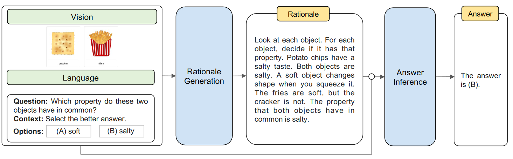

- [[ChatGenImage](http://arxiv.org/abs/2305.12799)]Interactive Data Synthesis for Systematic Vision Adaptation via LLMs-AIGCs Collaboration.[[code](https://github.com/Yuqifan1117/Labal-Anything-Pipeline)]
  
  - a new paradigm of annotated data expansion
  - how LLMs communicate with AIGC model
  
  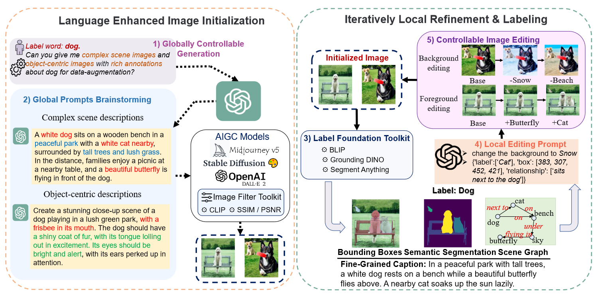
  
- [[Img2LLM-VQA](https://arxiv.org/pdf/2212.10846.pdf)]From Images to Textual Prompts: Zero-shot Visual Question Answering with Frozen Large Language Models.[[code](https://github.com/salesforce/LAVIS/tree/main/projects/img2llm-vqa)]

  - zero-shot VQA tasks
  - Image-grounded Text Encoder (ITE) in BLIP

  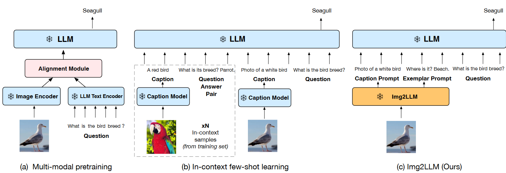

  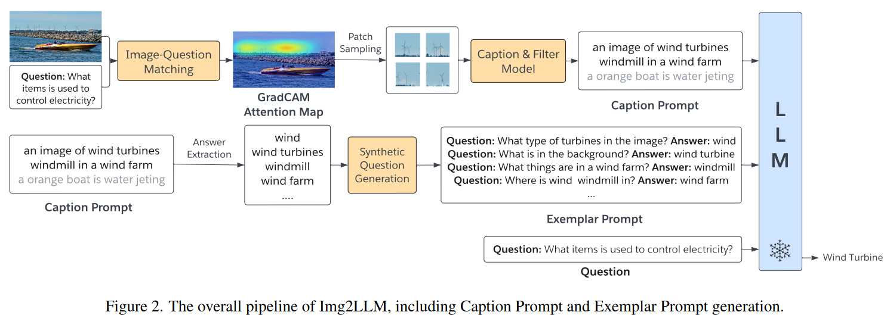

- [[LENS](https://arxiv.org/pdf/2306.16410.pdf)]:Towards Language Models That Can See: Computer Vision Through the LENS of Natural Language.[[code](https://github.com/ContextualAI/lens)]
  
  - Utilize completely frozen model to turn the input image into `<Tags>``<Attributes>``<Captions>`, followed by `<question>` 
  
  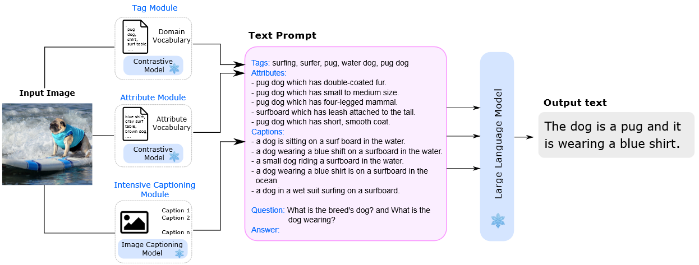
  
- [[SPAE](http://arxiv.org/abs/2306.17842)] Semantic Pyramid AutoEncoder for Multimodal Generation with Frozen LLMs.[[code](https://github.com/google-research/magvit/projects/spae)]
  
  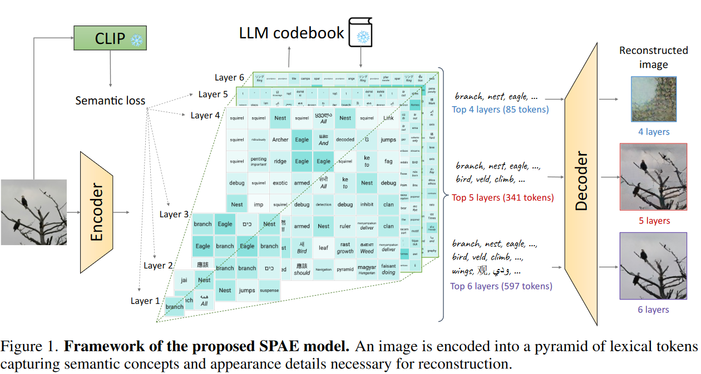
  
  - model non-linguistic modality as a language sequence that LLMs can comprehend
  - In contrast to the majority of VQ-VAE approaches, SPAE maps to an interpretable **discrete latent space**, i.e., words.
  - Dilation subsampler selects the positions for quantization
  - General Robust Image Task
  
- [[Unified-IO](https://arxiv.org/abs/2206.08916)] A Unified Model for Vision, Language, and Multi-Modal Tasks.[[demo](https://unified-io.allenai.org/)]

  - Insights：Seq2Seq model + 95 benchmark datasets，构建一个统一且有尽的 token-vocabulary将各种模态进行离散序列化
    - Text: Sentence Piece
    - Image(dense)
  - 训练代价：搭建了71 million to 2.9 billion四种不同大小的模型，首先使用无监督的文本、图像和文本图像对的损失进行预训练，接着使用多个任务进行联合训练。

  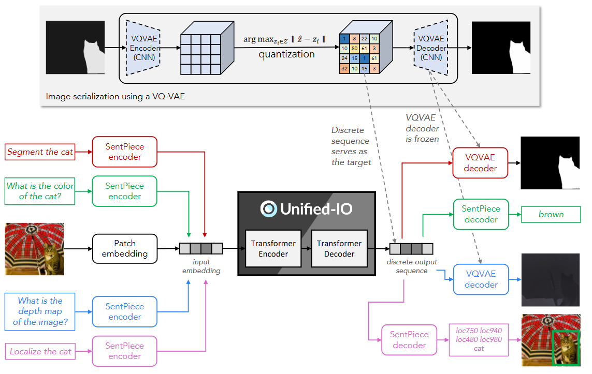

- [[VisionLLM](https://arxiv.org/abs/2305.11175)] Large Language Model is also an Open-Ended Decoder for Vision-Centric Tasks[[demo](https://igpt.opengvlab.com/)]

  - Insights: 将图像视为一种“外语”，并将其转换为离散的token表征。

  - Summary:分别使用常规的图像编码器与文本编码器提取多层次的视觉特征和文本特征，通过交叉注意力机制将文本特征注入图像特征（即Language-Guided Image Tokenizer），再借助`<embedding, position>`形式的Image Token作为`Query`既提取语义信息也提取位置信息。在送入LLMs的解码器之前，为解决类别和位置`token`数量不足的问题，将`<class>`与`<position>`进行增广，前者丰富了视觉任务的输出而后者则将回归问题实际上转换为离散的分类问题。最后，通过统一输出格式示例来限制LLMs的输出是高度与任务契合的(e.g., `<cls> <x1> <y1> <x2> <y2>`”for object detection, `<bos>` for image captioning)

  - 训练代价：4$\times$8 A100，可更新参数是Backbone和D-DETR和LLM的LoRA的少量参数

  

## 2. Awesome-Vision-Transformers

### 2.1 CVPR 2023

---

#### 2.1.1 Vision Transformer

- [[Castiling-ViT](https://openaccess.thecvf.com/content/CVPR2023/papers/You_Castling-ViT_Compressing_Self-Attention_via_Switching_Towards_Linear-Angular_Attention_at_Vision_CVPR_2023_paper.pdf)] Compressing Self-Attention via Switching Towards Linear-Angular Attention at Vision Transformer Inference. [[code](https://www.haoranyou.com/castling-vit/)]
  
  - Linear-Angular Attention to measuring spectral similarity
  
- [[HGFormer](https://openaccess.thecvf.com/content/CVPR2023/papers/Ding_HGFormer_Hierarchical_Grouping_Transformer_for_Domain_Generalized_Semantic_Segmentation_CVPR_2023_paper.pdf)]Hierarchical Grouping Transformer for Domain Generalized Semantic Segmentation [[code](https://github.com/dingjiansw101/HGFormer)]

- [[Token Labeling](https://proceedings.neurips.cc/paper/2021/hash/9a49a25d845a483fae4be7e341368e36-Abstract.html)]：All Tokens Matter: Token Labeling for Training Better Vision Transformers[[code](https://github.com/zihangJiang/TokenLabeling)]

- [[MAGVIT](https://arxiv.org/abs/2212.05199)]：Masked Generative Video Transformer. [[code](https://github.com/google-research/magvit)]

- [[ResFormer](https://arxiv.org/abs/2212.00776)]: Scaling ViTs with Multi-Resolution Training[[code](https://github.com/ruitian12/resformer)]

    - 词汇积累：plummets, discrepancy

- [[U-ViT](https://arxiv.org/abs/2209.12152)]：All are Worth Words: A ViT Backbone for Diffusion Models [[code](https://github.com/baofff/U-ViT)]
  - Diffusion + ViT

  

---

#### 2.1.2 Forgery

- [[AUNet](https://openaccess.thecvf.com/content/CVPR2023/html/Bai_AUNet_Learning_Relations_Between_Action_Units_for_Face_Forgery_Detection_CVPR_2023_paper.html)]Learning Relations Between Action Units for Face Forgery Detection[[code](https://github.com/wmbai/AUNet)]

- [[ERMPC](https://openaccess.thecvf.com/content/CVPR2023/papers/Li_Edge-Aware_Regional_Message_Passing_Controller_for_Image_Forgery_Localization_CVPR_2023_paper.pdf)]Edge-Aware Regional Message Passing Controller for Image Forgery Localization[code]

- [[TruFor](https://openaccess.thecvf.com/content/CVPR2023/html/Guillaro_TruFor_Leveraging_All-Round_Clues_for_Trustworthy_Image_Forgery_Detection_and_CVPR_2023_paper.html)]Leveraging All-Round Clues for Trustworthy Image Forgery Detection and Localization[[code](https://grip-unina.github.io/TruFor/)]

- [[Diffusion Art or Digital Forgery?]](https://arxiv.org/pdf/2212.03860.pdf) Investigating Data Replication in Diffusion Models. [code]

- [[AltFreezing](https://arxiv.org/pdf/2307.08317.pdf)]for More General Video Face Forgery Detection. [[code](https://github.com/ZhendongWang6/AltFreezing)]

- [[HiFi-IFDL](https://arxiv.org/abs/2303.17111)]Hierarchical Fine-Grained Image Forgery Detection and Localization.[[code](https://github.com/CHELSEA234/HiFi_IFDL)]

  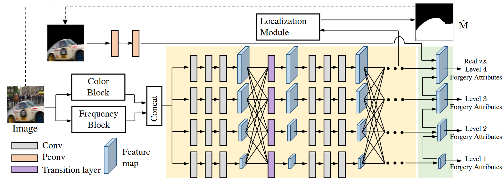

  - 首先通过LoG得到频域特征，一同送入多尺度提取模块来对判别树进行搜索

    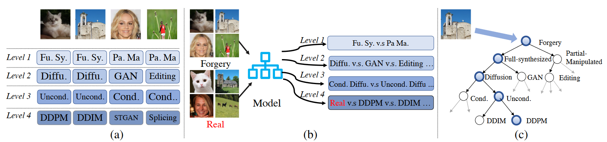

  - 定位则通过分辨率最高的特征图进行自注意力计算后得到，损失函数与LASTED相似，都是寻找训练集中的锚点，本论文还额外增加了一个裕量

  - 层次的结构之间含有依赖关系，通过scale的方式来强制学习这一信息，本质上是条件概率。

  

#### 2.1.3 MAE

- [[GAN-MAE](https://feizc.github.io/resume/ganmae.pdf)] Masked Auto-Encoders Meet Generative Adversarial Networks and Beyond [code]

### 2.2 Preprint

#### 2.1.1 Vision Transformer

- [[RetNet](https://arxiv.org/abs/2307.08621)]:A Successor to Transformer for Large Language Models[[code](https://github.com/microsoft/unilm)]
- [[SPViT](https://arxiv.org/abs/2111.11802)]: Pruning Self-attentions into Convolutional Layers in Single Path[[code](https://github.com/ziplab/SPViT)]
- 

#### 2.1.2 Forgery

- [[DADF](http://arxiv.org/abs/2306.17075)]:Detect Any Deepfakes: Segment Anything Meets Face Forgery Detection and Localization[[code](https://github.com/laiyingxin2/DADF)]

  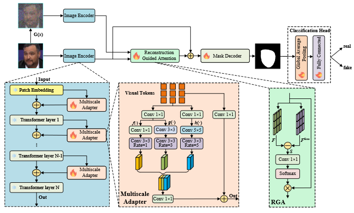

  - an image encoder with the Multiscale Adapters for feature extraction

    - freezing SAM
    - 可学习多尺寸卷积微调参数

  - a Reconstruction Guided Attention (RGA) module for forged feature refinement

    - 引入高斯白噪声来模拟篡改人脸图像

    - 同样经过编码器后视为重建图像$F^{Gau}$，与原图$F$相减，送入enhancer（$1\times1\ Conv$）+ softmax (attention map)，同时这里也提供一个重建损失监督信号，这里似乎有些矛盾，期望重建损失小，但$S$也会因此变小，得到的attn map也会因此不明显（？），猜测这里的残差连接会十分重要

    - 相当于前向传播两次，效率不高；噪声水平不高；编码器相当于一次处理两个任务；讲故事成分大一些

  - a mask decoder for forgery mask prediction

- [[LASTED](http://arxiv.org/abs/2305.13800)]:Generalizable Synthetic Image Detection via Language-guided Contrastive Learning[[code](https://github.com/HighwayWu/LASTED)]

  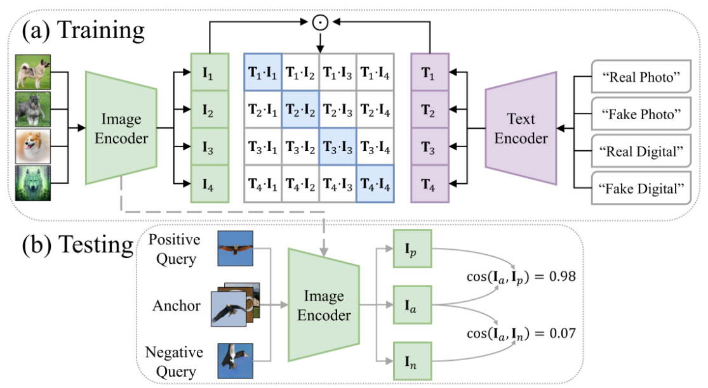
  
  - 词汇：heightened, malevolent, dissemination, authenticity, forensic,speculate, aforementioned, disseminated
  - 训练阶段对齐预定义的文本特征：augment the training images with carefully-designed textual labels
  - 测试阶段使用anchor representation进行判别
  - language supervision，有点prompt engineer的感觉，但却说明指定图像的类型是有必要的，另外只针对detection来做，数据多样性不足（无mixture）

#### 2.1.3 MAE

## Reference

- [ICLR2023](https://openreview.net/group?id=ICLR.cc/2023/Conference)
- [CVPR2023](https://cvpr2023.thecvf.com/Conferences/2023/AcceptedPapers)
- [CVPRW2023](https://openaccess.thecvf.com/CVPR2023_workshops/menu)
- [WACV2023](https://openaccess.thecvf.com/WACV2023)
- [IJCAI2023](https://ijcai-23.org/main-track-accepted-papers/)
- [ECCV2022](https://eccv2022.ecva.net/program/accepted-papers/)
- [MM-2022-Proceedings](https://dl.acm.org/doi/proceedings/10.1145/3503161) 
- [SIGGRAPH2023](https://kesen.realtimerendering.com/sig2023.html)
- [ICML2022](https://dblp.org/db/conf/icml/icml2022.html)
- [AAAI2022](https://dblp.org/db/conf/aaai/aaai2022.html)
- [TIFS](https://ieeexplore.ieee.org/xpl/RecentIssue.jsp?punumber=10206)