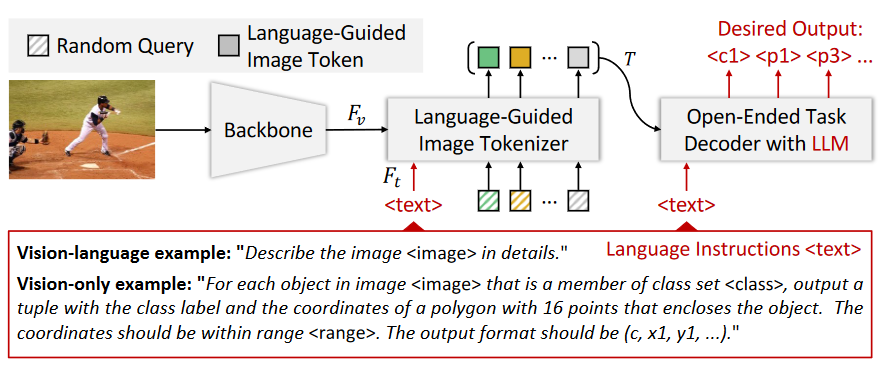

## Collections of Paper Focused on LMM4Vision or ViTs.

Warmly welcome anyone to open issues or pull requests (recommended):hugs:

### Awesome-LMM4Vision

- 复杂的视觉任务常常因为输出的多样性而难以统一，但借助自然语言的灵活性或许可以提供一种可行的措施。
- LMM's specialness 
  - Combination of continuous and discrete representation -> Extend vocabulary
  - LLMs' Chain of Thought and In context Learning: Output Format
  - Open-Vocabulary Vision Multi-tasks Joint Training：借助LLMs进行多个视觉任务的共同学习（如[DetCLIPv2](https://arxiv.org/pdf/2304.04514.pdf)**交替使用**不同类型的数据如Detection、Grounding和Image-Text pair进行学习，分别赋予模型定位和对更广泛概念的认识，从而实现OVD），飞轮效应。
  - 与之呼应的是分两阶段进行训练，首先选择一个足够具备挑战性的任务进行预训练（例如[Hiera](https://arxiv.org/abs/2306.00989)则选取Mask Image Model来作为代表性任务训练自己所提出的transformer模型）再多任务联合训练

- Preliminary: Visual tasks：“**What is where?**"
  - I/O Modality
    - Vision-only: Classification, Synthesis* 
    - **Vision-Language**: Captioning, VQA, Image Retrieval, Synthesis* 
  - Dense or Sparse: Segmentation, Grounding, Estimation* /Detection

- 若视觉任务的输出可以通过语言符号（文本、数字）来统一的表示，则可以很自然的将图像特征编码同文本编码经过处理后同等看待的喂入LLMs的解码器即可；若为底层视觉任务或生成任务，那么文本信息更多扮演的是指令的角色，借鉴CLIPDraw中的思想就是正负提示词

- [[LENS](https://arxiv.org/pdf/2306.16410.pdf)]:Towards Language Models That Can See: Computer Vision Through the LENS of Natural Language.[[code](https://github.com/ContextualAI/lens)]
  
  - Utilize completely frozen model to turn the input image into `<Tags>``<Attributes>``<Captions>`, followed by `<question>`
  
- [[SPAE](http://arxiv.org/abs/2306.17842)] Semantic Pyramid AutoEncoder for Multimodal Generation with Frozen LLMs.[[code](https://github.com/google-research/magvit/ projects/spae)]
  
  - model non-linguistic modality as a language sequence that LLMs can comprehend
  - In contrast to the majority of VQ-VAE approaches, SPAE maps to an interpretable **discrete latent space**, i.e., words.
  - Dilation subsampler selects the positions for quantization
  - General Robust Image Task
  
- [[Unified-IO](https://arxiv.org/abs/2206.08916)] A Unified Model for Vision, Language, and Multi-Modal Tasks.[[demo](https://unified-io.allenai.org/)]

  - Insights：Seq2Seq model + 95 benchmark datasets，构建一个统一且有尽的 token-vocabulary将各种模态进行离散序列化
    - Text: Sentence Piece
    - Image(dense): 
  - 训练代价：搭建了71 million to 2.9 billion四种不同大小的模型，首先使用无监督的文本、图像和文本图像对的损失进行预训练，接着使用多个任务进行联合训练。

- [[VisionLLM](https://arxiv.org/abs/2305.11175)] Large Language Model is also an Open-Ended Decoder for Vision-Centric Tasks[[demo](https://igpt.opengvlab.com/)]

  - Insights: 将图像视为一种“外语”，并将其转换为离散的token表征。

  - Summary:分别使用常规的图像编码器与文本编码器提取多层次的视觉特征和文本特征，通过交叉注意力机制将文本特征注入图像特征（即Language-Guided Image Tokenizer），再借助`<embedding, position>`形式的Image Token作为`Query`既提取语义信息也提取位置信息。在送入LLMs的解码器之前，为解决类别和位置`token`数量不足的问题，将`<class>`与`<position>`进行增广，前者丰富了视觉任务的输出而后者则将回归问题实际上转换为离散的分类问题。最后，通过统一输出格式示例来限制LLMs的输出是高度与任务契合的(e.g., `<cls> <x1> <y1> <x2> <y2>`”for object detection, `<bos>` for image captioning)

  - 训练代价：4$\times$8 A100，可更新参数是Backbone和D-DETR和LLM的LoRA的少量参数

  

### Awesome-Vision-Transformers

#### CVPR 2023

- [[Castiling-ViT](https://openaccess.thecvf.com/content/CVPR2023/papers/You_Castling-ViT_Compressing_Self-Attention_via_Switching_Towards_Linear-Angular_Attention_at_Vision_CVPR_2023_paper.pdf)] Compressing Self-Attention via Switching Towards Linear-Angular Attention at Vision Transformer Inference. [[code](https://www.haoranyou.com/castling-vit/)]
  - Linear-Angular Attention to measuring spectral similarity

- [[HGFormer](https://openaccess.thecvf.com/content/CVPR2023/papers/Ding_HGFormer_Hierarchical_Grouping_Transformer_for_Domain_Generalized_Semantic_Segmentation_CVPR_2023_paper.pdf)]Hierarchical Grouping Transformer for Domain Generalized Semantic Segmentation [[code](https://github.com/dingjiansw101/HGFormer)]

